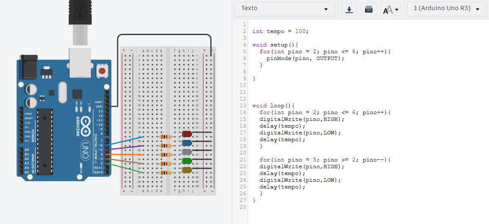
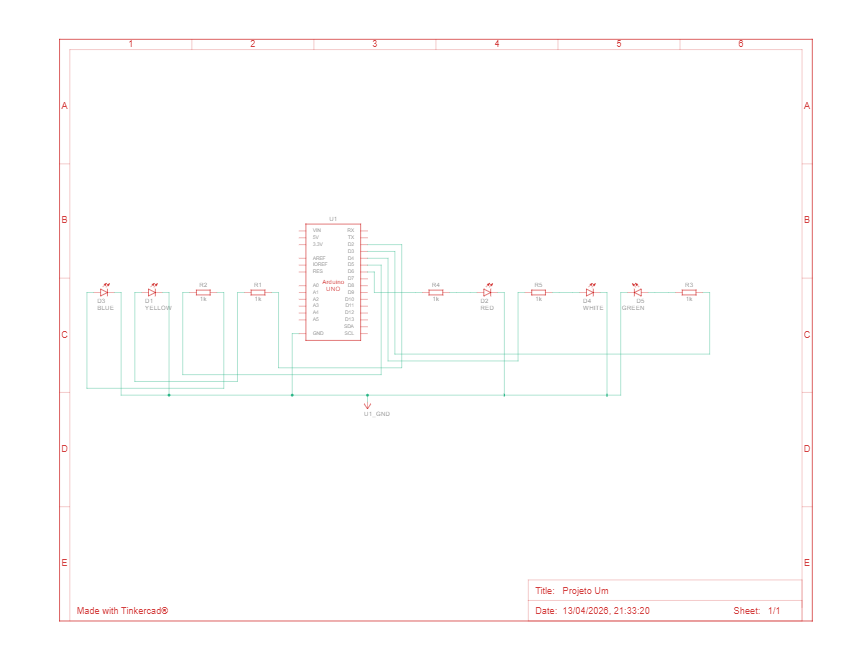

# LED Sequence - Arduino Uno (Knight Rider Effect)

Este projeto demonstra uma sequência de iluminação em cascata utilizando um Arduino Uno R3. A lógica cria um efeito de "ida e volta", popularmente conhecido como efeito Knight Rider.

## 🛠️ Hardware e Montagem
O circuito utiliza 5 LEDs conectados aos pinos digitais 2 a 6. Foram utilizados resistores de 1kΩ para garantir a integridade dos componentes.

### Layout do Protoboard

### Esquema Elétrico

## 💻 Lógica de Programação
O código foi estruturado com loops `for` para otimizar o uso da memória e facilitar a manutenção da velocidade da sequência através da variável `tempo`.

O código fonte completo pode ser encontrado na pasta [`src/`](./src).

---
*Projeto desenvolvido como parte dos estudos de Análise e Desenvolvimento de Sistemas.*
